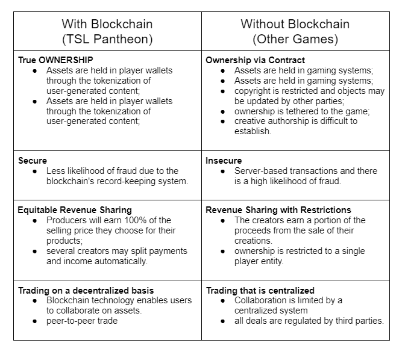

# Benefits

The development of a decentralized blockchain-based gaming platform offers several advantages over existing, non-blockchain-based systems, as indicated in the chart below:

### True ownership of digital assets

Gamers would retain ownership of their digital objects in perpetuity, even if the game was closed or abandoned. Every gaming object may be tokenized using blockchain technology, enabling players to choose how they wish to trade, sell, or give their stuff.

### **Trading**

Users may have complete control over their digital assets while using blockchain-based gaming systems. They may freely purchase and sell stuff without fear of being duped or of a platform closing and wiping away the value of their in-game items.

### **SECURE and UNCHANGEABLE**

Tokenized digital game assets may be readily exchanged in main and secondary markets that are governed and enabled by blockchain technology. Scarcity and demand-based items are prone to fraud and theft, but these risks are mitigated on the blockchain, which is a distributed record.

### **INTEROPERABILITY of CROSS-APPLICATION**

The blockchain enables games to make use of shared assets. Other games may reuse items, characters, and other game components. These gaming goods are no longer constrained by a limited digital environment.

