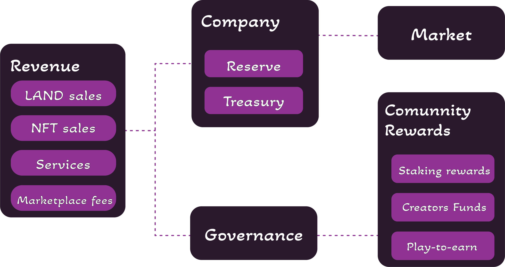

# TSLT Stakeholders

We've devised a four-stakeholder model to guarantee that TSB's success accrues value to the token. As a result, we will establish via smart contracts that income produced by The TSL Pantheon will be allocated among four stakeholders to sustain the creator and player ecosystems and give the resources necessary to build the market and create high-quality gaming experiences.

These four stakeholders are as follows:

1. &#x20;Foundation Pool: Is intended to guarantee that income earned by the game accrues to the token's worth. The Foundation pool's token allocation will gradually decentralize as we transition from a DAO/Community-driven solution to a decentralized approach for the benefit of the token ecosystem.
2. &#x20;Staking Pool: Is intended to offer token holders a dividend and value. Its governance will transition from centralized decision-making in year one to a decentralized autonomous organization (DAO) mechanism in the future years. Token holders who are also active participants will get an additional return for their participation.
3. &#x20;Business Treasury: This is the TSLT held by the company and is derived from the revenues of the sale of company-owned assets. It is locked up for a period of 12 months. The TSLT created by this Treasury will be resold to the market in order to cover operating expenditures.
4. &#x20;Company Reserve: This represents the company's initial reserve of 200mm TSLT (20% of total Token Supply). This reserve will be replenished using profits from the sale of company-owned assets subject to a six-month lock-up period.

