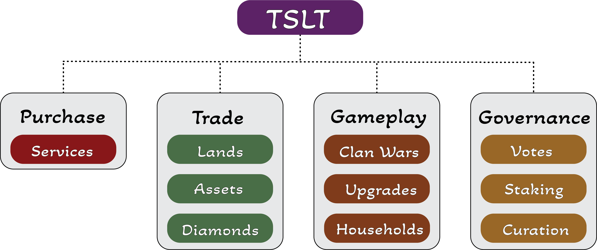

# TSLT Use Cases

TSLT is a critical component of The TSL Pantheon platform, and we are trying to build crucial dynamics that will bind it inextricably to the platform and its value. TSLT is an ERC-20 utility token based on the Ethereum blockchain that acts as the medium of exchange for transactions inside The TSL Pantheon.

* The TSL Pantheon platform allows players to spend TSLT on games, equipment, and customizing their Avatar persona. Creators pay TSLT to obtain ASSETS, LANDS, and Staking. LAND Sales generate demand for TSLT, which is used to acquire LANDS. TSLT is used by artists to submit ASSETS to the Marketplace and to purchase Gems that define Rarity and Scarcity.
* TSLT is a governance token that enables holders to participate in the platform's governance decisions through a DAO framework. They have voting rights over critical platform components such as attribution of Foundation grants to content and game producers and feature priority on the platform Roadmap. TSLT owners have the option of voting personally or delegating voting privileges to other players.
* Staking: TSLT allows for staking, which enables passive income generation on LANDS: by staking it, you get additional TSLT.
* Build Households with TSLT and rent them to the Clan members to make an income from TSLT.

